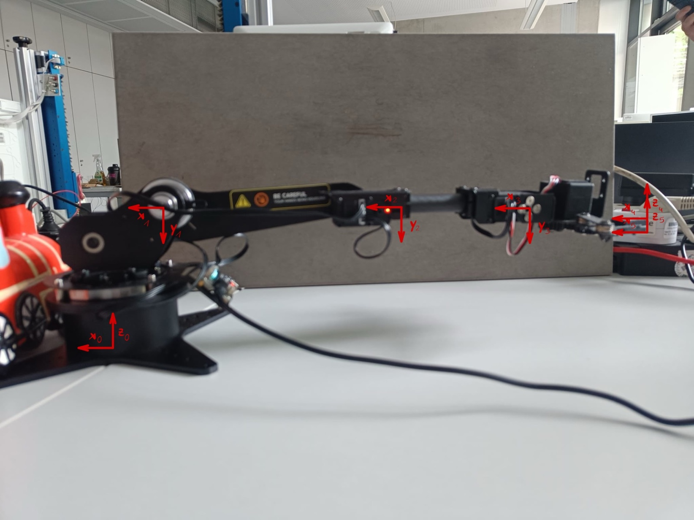

<!--- CPS
Author: Raphael Schmid  Date: 06.12.2024 
Changes by:
Raphael Schmid - 06.12.2024 - Anfertigung: Projektbeschreibung, Voraussetzungen und erforderliche Materialien
Raphael Schmid - 07.12.2024 - Anfertigung: Grundlagen
--->
**Robotik**     
Fakultät 04
***

# Modularbeit: Robotik

## Verfasser: Lennard Tim Keitel

***
## Aufgabenbeschreibung
Im folgenden werden die Kinematik und Bewegungsplanung von Robotern untersucht. Die verwendeten Robotor sind ein RoArm-M1 und ein UR3. Für den RoArm1 werden die DH-Parameter, die Vorwärts- und Rückwärtskinematik bestimmt. 
Für den UR3 wird eine Bewegung ausgeführt und diese wird dann simuliert und mit der realen Bewegung verglichen.

***

**Inhalt Zusammenfassung:**

Aufgabe 1: Kinematische Analyse des RoArm M1

- Anwendung der klassichen  Denavit-Hartenberg-Konvention

- Fotodokumentation des Roboters (Seiten- und Draufsicht)

- Einzeichnen der Koordinatensysteme an jedem Gelenk

- Erstellung der vollständigen DH-Tabelle auf Basis der Fotos

Aufgabe 2: Vorwärtskinematik

- Implementierung der Vorwärtskinematik in Python mithilfe der DH-Tabelle

- Berechnung der Transformationsmatrix des Endeffektors für gegebene Gelenkwinkel q = [180, 30, 90, -60, 180]

- Fotodokumentation der entsprechenden Roboterpose

- Vergleich zwischen berechneter Pose und realer Stellung

Aufgabe 3: Rückwärtskinematik

- Verschiebung des Endeffektors um 5 mm in negative z-Richtung (Weltkoordinatensystem), Orientierung bleibt konstant

- Implementierung der Rückwärtskinematik zur Berechnung aller möglichen Gelenkkonfigurationen

- Bewertung der Lösungen nach Praxistauglichkeit (z. B. Erreichbarkeit, Kollision)

- Foto der bevorzugten Lösung

Aufgabe 4: Bewegungsanalyse am UR3-Roboter

- Durchführung eines movel-Befehls aus definierter Startstellung

- Aufzeichnung von Soll- und Ist-Werten (Winkel, Geschwindigkeiten, TCP-Pose, TCP-Geschwindigkeiten)

- Python-Simulation der Bewegung inkl. Rückwärtskinematik und Jacobi-Matrix zur Geschwindigkeitsberechnung

- Vergleich von Simulation vs. realer Bewegung (inkl. Fehleranalyse und Diagrammen)

***


## Aufgabe 1: Kinematische Analyse des RoArm M1

### Hinweis: 
Beim Einzeichnen der Koordinatensystem gilt die Linkshändigkeit. Die Bilder wurden für ein q2 von 90° aufgenommen.

***
Die dh-Parameter wurden in der Winkelstellung (0,90,0,0,0) aufgenommen. Somit ergibt sich für θ2 -90°, die restlichen Werte für θ sind 0.
Das Basiskoordinatensystem wurde anhand der positiven Bewegungsrichtung des  RoArm-M1 festgelegt. 
Das erste Koordinatensystem(x1,y1,z1) ist um 115,74 mm entlang der z0-Achse und um -41,05 mm entlang der x0-Achse verschoben. Außerdem ist z1 gegenüber z0 um 90° gedreht.\
Das zweite Koordinatensystem (x2,y2,z2) wurde entlang der x1-Achse um -168,68 mm verschoben\
Das dritte Koordinatensytem (x3,y3,z3) wurde entlang der x2-Achse um-127,92 mm und um -13,99 mm entlang der z2-Achse verschoben.\
Das vierte Koordinatensystem (x4,y4,z4) wurde entlang der x3-Achse um -108,54 mm verschoben und z4 ist gegenüber z3 um -90° gedreht.\
Das fünfte Koordinatensystem (x5,y5,z5) wurde entlang der z4-Achse um -10,96 mm verschoben.

Die folgenden Abbilung zeigt die eingzeichneten Koordinatensysteme von der Seite und von oben:



Aus den Koordinatensystemen und zeichnungen entstehen folgende modifizierte DH-Parameter:
|     α     |    a      |    d      |     θ     |n|
|:---------:|:---------:|:---------:|:---------:|:---------:|
| 1.570796  | -0.04105  |0.11574    |  0.0      |1|
| 0.0       | -0.16886  | 0.0       |  -1.570796|2|
| 0.0       | -0.12792  | -0.01399  |  0.0      |3|
| -1.570796 | -0.10854  |    0.0    |   0.0     |4|
| 0.0       | 0.        | -0.01096  |   0.0     |5|


Bei der Berechnung der Vor -und Rückwärtskinematik muss der Offset beachtet werden.

### Hinweis:
Die Längenangaben der DH-Paramter sind in Metern und die Winkelangaben in Rad.


## Aufgabe 2: Vorwärtskinematik
Bei der Vorwärtskinematik sollen anhand der vorgegebenen Winkel, die Position des Endeffektors im Basiskoordinatensystems bestimmt werden.

Folgende Funktionen dient zu berechnung der Vorwärtskinematik:

```python
def fk_RoArm(alpha,a,d,theta):
    """
    Forward Kinematics for UR type robots
    """
    T_0_5 = np.eye(4)
    for i in range(len(alpha)):
        T_0_5=T_0_5@dh(alpha[i],a[i],d[i],theta[i])
    return T_0_5

def dh(alpha, a, d, theta):
    """
    Denavit-Hartenberg (classic)
    """
    T = np.zeros(4)
    ct=np.cos(theta)
    st=np.sin(theta)
    sa=np.sin(alpha)
    ca=np.cos(alpha)
    T = np.array([[ct,   -st*ca,     st*sa, a*ct ],
                  [st,   ct*ca,     -ct*sa,a*st ],
                  [0,     sa,              ca    ,      d  ],
                  [0,       0                   ,0         , 1]])
    
    return T
```
DIe nächste Funktion dient zur umrechnung von einer T-Matrix in eine Pose in(x,y,z,rx,ry,rz)-Darstellung:


```python
def T_2_rotvec(T):
    """
    homogeneous trafo matrix to rotation vector representation
    """
    R = T[0:3, 0:3]
    x, y, z = T[0:3, 3]
    theta=np.arccos((R[0][0]+R[1][1]+R[2][2]-1)/(2))
    k=1/(2*np.sin(theta))*np.array([R[2][1]-R[1][2],R[0][2]-R[2][0],R[1][0]-R[0][1]])
    pose=np.array([x,y,z,k[0]*theta,k[1]*theta,k[2]*theta])
    return pose

```
Die vorgegbenen Winkel lauten: q = [180,30,90,-60,180]\

```python
qRoArm=np.array([0,-90,0,0,0])
q_calc = np.array([180, 40, 90, -60 , 180, 0.0]) / 180 * np.pi + qRoArm
```
Nun können die Funktionen aufgerufen werden:

```python
alpha=np.array([+np.pi/2,0,0,-np.pi/2,0])
    a=np.array([-0.04105,-0.16886,-0.12792,-0.10854,0])
    d=np.array([0.11574,0,-0.01399,0,-0.01096])
    theta=np.array([180,40-90,90,-60,180])*(np.pi/180) #Winkel2 -90 Grad Offset
    T=fk_ur(alpha,a,d,theta)
    print(T)
    print(T_2_rotvec(T))
```

```python
Folgendes wird ausgegeben:

[[ 9.39692621e-01  2.58486530e-16 -3.42020143e-01  3.53326299e-01]
 [-2.58486530e-16  1.00000000e+00  4.55781493e-17 -1.39900000e-02]
 [ 3.42020143e-01  4.55781493e-17  9.39692621e-01  1.89692709e-01]
 [ 0.00000000e+00  0.00000000e+00  0.00000000e+00  1.00000000e+00]]
[ 3.53326299e-01 -1.39900000e-02  1.89692709e-01  3.14496739e-33
 -3.49065850e-01 -2.63811422e-16]
```
Im folgenden sieht man ein Bild der realen Position.


## Aufgabe 3: Rückwärtskinematik

Im Folgenden wird die Rückwärtskinematik für den ROArm berechnet. Die ursprüngliche Position wird um 5 mm nach unten entlang der z-Achse bewegt werden. Die Ursprünglichen Gelenkwinkel aus Aufgabe 2 sind: 

```python
[180, 30, 90, -60 , 180,]
```
Die Rotationvectordasrtellung der Ursprungsoposition lautet:

```python
 Rotationsvectordarstellung der Ursprungsposition:
[ 3.53326299e+02 -1.39900000e+01  1.89692709e+02  3.14496739e-33
 -3.49065850e-01 -2.63811422e-16]

 ```


Die neue Rotationvectordarstellung lautet: 
 ```python

Rotationsvectordartellung der Neuen Position (z= z - 5mm)
 [3.53326299e+02 -1.39900000e+01  1.84692709e+02  3.14496739e-33
 -3.49065850e-01 -2.63811422e-16]
```


Mit folgender Funktion wird die Rückwärtskinematik berechnet:


```python
Rückwärts Kinematik RoArm


def inv_RoArm(alpha,a,d, pose, qGripper):
    """ 
    #Backwards Kinematics for RoArm-M1
    """
    # DH-parameter in geeigente Form bringen
    # Pose in Matrix umwandeln
    T05 = rotvec_2_T(pose)
    # Rotation matrix des TCP
    R = T05[0:3, 0:3]
    # Translation des TCP
    P05 = T05[:4, 3]
    
    # Koordinatentransformation
    theta = -np.sign(R[2,0])*np.arccos(R[2,2])
    q1 = np.arctan2(R[1,0], R[0,0]) + np.pi
    Rz = rotz_lh(q1-np.pi)  
    P04 = T05 @ np.array([a[3], 0, -d[4], 1])
    P04_bo = Rz @ P04  
    P02 = np.array([-a[0], 0, d[0], 1])
    P24 = P04_bo - P02  
    x = P24[0]  
    z = P24[2]  
    
    # Restliche Gelenkwinkel berechnen
    if((x**2 + z**2) <= (-a[1]-a[2])):
        # Erste Lösung:
        cosq31 = (x**2 + z**2 - a[1]**2 - a[2]**2)/(2*a[1]*a[2])
        q31 = np.arccos(cosq31) 
        print(q31)
        if(q31 < 0):  
            # Hilfswinkel berrechen
            psi = np.arccos((x**2 + z**2 + a[1]**2 - a[2]**2)/(2*a[1]*np.sqrt(x**2 + z**2)))
            beta = np.arctan2(z,x)
            
            q21 = np.pi/2 - (beta - psi); 
            q41 = theta - q31 - q21 + np.pi/2 
            # Zweite Lösung:
            q32 = -q31;
            q22 = np.pi/2 - (beta + psi); 
            q42 = theta - q32 - q22 + np.pi/2
        else:
            # Erste Lösung:
            # Hilfswinkel berrechen
            psi = np.arccos((x**2 + z**2  +a[1]**2 - a[2]**2)/(2*-a[1]*np.sqrt(x**2 + z**2)))
            beta = np.arctan2(z,x)
            print(psi)
            print(beta)
            q21 = np.pi/2 - (beta + psi); 
            q41 = theta - q31 - q21 + np.pi/2 
            # Zweite Lösung:
            q32 = -q31;
            q22 = np.pi/2 - (beta - psi); 
            q42 = theta - q32 - q22 + np.pi/2 
    else:
        print("Nicht lösbar")
        
    Q = np.array([[q1, q21, q31, q41, qGripper], [q1, q22, q32, q42, qGripper]])  
    return Q

def rotz_lh(theta):
    # Rotation um z im linkshändigen System: Vorzeichen invertieren
    c, s = np.cos(-theta), np.sin(-theta)
    return np.array([(c, -s, 0, 0),(s,  c, 0, 0), (0,  0, 1, 0), (0, 0, 0, 1)])

def rotvec_2_T(xyzrxryrz):
    """
    pose with rotation vector representation to homogeneous trafo matrix
    """
    T = np.eye(4)
    x, y, z, rx, ry, rz = xyzrxryrz
    theta=np.sqrt(rx**2+ry**2+rz**2)
    kx=rx/theta
    ky=ry/theta
    kz=rz/theta
    c = np.cos(theta)
    s = np.sin(theta)
    v = 1-c
    R = np.array([[kx*kx*v+c,       kx*ky*v-kz*s,       kx*kz*v+ky*s],
                  [kx*ky*v+kz*s,    ky*ky*v+c,          ky*kz*v-kx*s],
                  [kx*kz*v-ky*s,    ky*kz*v+kx*s,       kz*kz*v+c   ]])
    T[0:3,0:3]=R
    T[0:3,3]=x,y,z
    return T
```

Folgende Main-Funktion wurde verwendet:

```python
alpha=np.array([+np.pi/2,0,0,-np.pi/2,0])
a=np.array([-0.04105,-0.16886,-0.12792,-0.10854,0])
d=np.array([0.11574,0,-0.01399,0,-0.01096])

qTest = np.array([180, 40, 90, -60 ,180])*np.pi/180.0 + qRoArm
qRoArm = np.array([0, -1.570796327, 0.0, 0.0, 0.0])

T_0_5 = fk_RoArm(alpha,a,d, qTest)
print("Rotationsmatrix")
print(T_0_5)
pose = T_2_rotvec(T_0_5)
# Verschiebung der pose in Weltkoordinaten, bei gleicher Orientierung
pose_new = T_2_rotvec(transl(0,0,-0.005 ) @ T_0_5)
print("Alte Pose:")
print(pose)
print("Neue Pose:")
print(pose_new)


q = pose_new
solution = inv_RoArm(alpha,a,d, q, np.pi)
print("GelenkWinkel:")
print(solution[0]*(180/np.pi))
print(solution[1]*(180/np.pi))
```

Folgendes wuerde ausgegben: 


```python
Ausgabe:
Transformationsmatrix der Ursprungsposition

[[ 0.93969  0.      -0.34202  0.35333]
 [-0.       1.       0.      -0.01399]
 [ 0.34202  0.       0.93969  0.18969]
 [ 0.       0.       0.       1.     ]]
Alte Pose:
[ 0.35333 -0.01399  0.18969 -0.      -0.34907 -0.     ]
Neue Pose:
[ 0.35333 -0.01399  0.18469 -0.      -0.34907 -0.     ]
GelenkWinkel:
[180.       41.10973  90.5919  -61.70164 180.     ]
[180.      115.83212 -90.5919   44.75978 180.     ]

```

Es wird der erste Gelenkwinkel angefahren. Erstens kann er schneller angefahren werden, das die Gelenkwinkel näher beieinandernliegen und zweitens kann der zweite gar nicht angefahren werden, da der dritte Gelenkwinkel die Grenzen der Befahrbaren Winkel des Roboters verlässt:


```python
[180.      112.4281  -89.20217  46.77407 180.        0.     ]
```

Für den zweiten WInkel 112.4 Grad können nicht angestuert werden, da der Roboter nur bis 105 Grad fahren kann.


Folgende Winkel werden angefahren:
[180.       38.71982  89.20217 -57.92199 180.        0.     ]


Der neue Winkel wurde auch angefahren. Er zeigt das die Berechnungen korrekt sind und der Robiter seknrecht um 6mm nach oben fährt.

#### Siehe folgende Bilder:


*Ausgangsposition*


*Endposition*


## Aufgabe 4: UR-Roboter


Ausgabe:


```python
Bewegung von 6440.072 s bis 6441.728 s:
  Dauer: 1.656 s
  Max. Geschwindigkeit: 0.041 m/s
  Anzahl Schaltzeitpunkte: 85
  Schaltzeitpunkte: [6440.08, 6440.088, 6440.096, 6440.103999999999, 6440.255999999999, 6440.264, 6440.48, 6440.487999999999, 6440.496, 6440.5199999999995, 6440.536, 6440.567999999999, 6440.576, 6440.584, 6440.592, 6440.599999999999, 6440.607999999999, 6440.616, 6440.632, 6440.639999999999, 6440.648, 6440.656, 6440.664, 6440.672, 6440.679999999999, 6440.696, 6440.704, 6440.7119999999995, 6440.719999999999, 6440.728, 6440.736, 6440.759999999999, 6440.776, 6440.784, 6440.7919999999995, 6440.808, 6440.816, 6440.831999999999, 6440.84, 6440.864, 6440.871999999999, 6440.888, 6440.9039999999995, 6440.911999999999, 6440.928, 6440.936, 6440.9439999999995, 6440.9839999999995, 6440.991999999999, 6441.008, 6441.016, 6441.032, 6441.04, 6441.056, 6441.063999999999, 6441.08, 6441.096, 6441.103999999999, 6441.112, 6441.128, 6441.143999999999, 6441.16, 6441.168, 6441.183999999999, 6441.208, 6441.215999999999, 6441.224, 6441.232, 6441.255999999999, 6441.264, 6441.272, 6441.28, 6441.288, 6441.304, 6441.312, 6441.3279999999995, 6441.335999999999, 6441.3679999999995, 6441.375999999999, 6441.392, 6441.4, 6441.504, 6441.512, 6441.527999999999, 6441.536]
```


*Target-Werte*


*Echte-Werte*


